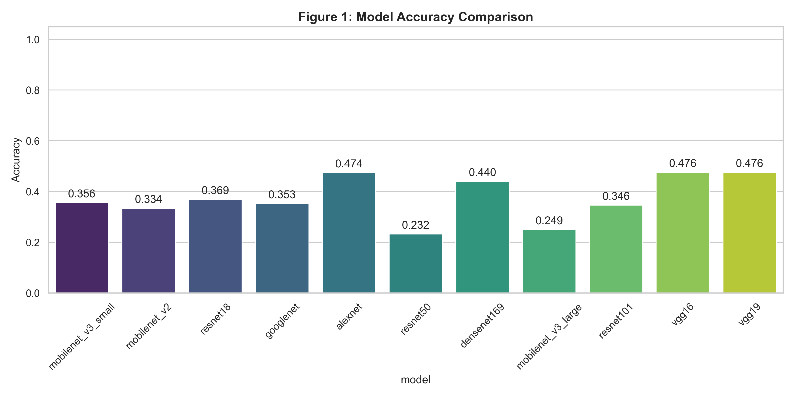
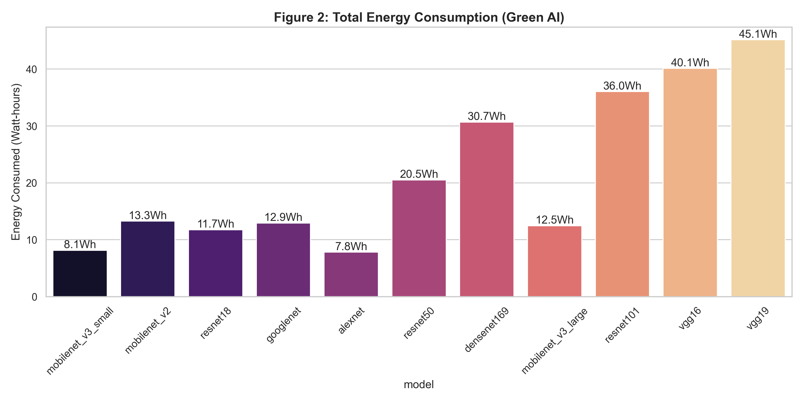
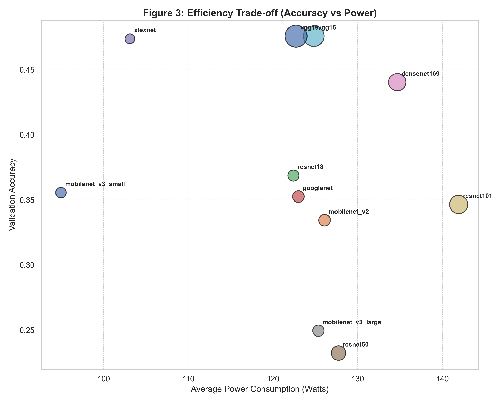

# 🩺 Skin Cancer Classification with Green AI Analysis
### Deep Learning Performance & Energy Efficiency Comparison


## 📖 Abstract

This project focuses on the classification of skin cancer images (Benign vs. Malignant) using **Deep Learning**. We implemented and trained **11 different Convolutional Neural Network (CNN) architectures**, ranging from lightweight models (MobileNet) to heavy-duty models (VGG19).

Unlike traditional studies that focus solely on **Accuracy**, this project introduces **"Green AI" metrics**. By utilizing NVIDIA's management library (`pynvml`), we monitored real-time GPU power consumption (Watts) and total energy usage (Watt-hours) to analyze the trade-off between diagnostic performance and computational cost.

## 🚀 Key Features

*   **11 Models Benchmarked**: Comprehensive comparison of `MobileNetV2/V3`, `ResNet18/50/101`, `DenseNet169`, `VGG16/19`, `GoogleNet`, and `AlexNet`.
*   **Green AI Monitoring**: Real-time tracking of **GPU Power (Watts)** and **Energy Efficiency**, providing a sustainability perspective on AI in healthcare.
*   **Dynamic Resource Management**: Automated batch-size adjustment to prevent Out-Of-Memory (OOM) errors on 12GB VRAM GPUs (specifically for VGG/DenseNet).
*   **Data Augmentation**: Robust preprocessing pipeline including rotation, flipping, and color jittering to prevent overfitting.
*   **IEEE-Style Visualization**: Automated generation of publication-ready charts (Accuracy, ROC Curves, Energy Consumption).

## 📂 Dataset Acquisition

The final dataset (~13,000 images) is a combination of two major sources. You can reproduce the dataset using the Kaggle API with the following commands:

### 1. Prerequisites
Ensure you have the Kaggle API installed and your `kaggle.json` credentials configured in `~/.kaggle/`.
```bash
pip install kaggle
```

### 2. Download Commands
Run these commands to download and unzip the datasets into temporary folders:

**Source A: Skin Cancer Malignant vs. Benign (Kaggle)**
```bash
kaggle datasets download -d fanconic/skin-cancer-malignant-vs-benign --unzip -p ./temp_source_a
```

**Source B: Melanoma Skin Cancer Dataset (ISIC Subset)**
```bash
kaggle datasets download -d hasnainjaved/melanoma-skin-cancer-dataset-of-10000-images --unzip -p ./temp_source_b
```

### 3. Data Consolidation
After downloading, merge the images into a unified directory structure as expected by the training script:
```text
dataset/
    ├── benign/      <- Combine all benign images here
    └── malignant/   <- Combine all malignant images here
```

## 🛠️ Methodology

### 1. Model Selection
We categorized models into three groups for analysis:
*   **Lightweight**: MobileNetV3 (Small/Large), MobileNetV2.
*   **Medium**: ResNet18, ResNet50, GoogleNet, AlexNet.
*   **Heavyweight**: ResNet101, VGG16, VGG19, DenseNet169.

### 2. Experimental Setup
*   **Environment**: Python 3.10, PyTorch, CUDA 11.8.
*   **Hardware**: NVIDIA GPU (12GB VRAM).
*   **Optimizer**: AdamW (`lr=1e-4`).
*   **Loss Function**: CrossEntropyLoss.
*   **Epochs**: 15 per model.

## 📊 Results & Visualization

### 1. Accuracy Comparison
Comparison of model performance on the test set.


### 2. Energy Consumption (Green AI)
Total energy consumed (Watt-hours) during the training phase.


### 3. Efficiency Trade-off (Accuracy vs. Power)
A bubble chart visualizing the trade-off.
*   **X-Axis**: Power Consumption (Watts)
*   **Y-Axis**: Accuracy
*   **Bubble Size**: Training Time


### 4. ROC Curves
Receiver Operating Characteristic curves for diagnostic capability.


## 💻 Installation & Usage

### Step 1: Clone the Repository
```bash
git clone https://github.com/Siew22/AI_ASSIGNMENT.git
cd AI_ASSIGNMENT
```

### Step 2: Install Dependencies
```bash
pip install -r requirements.txt
pip install nvidia-ml-py
```

### Step 3: Run Training
This script trains all 11 models sequentially and logs metrics.
```bash
python train.py
```

### Step 4: Generate Visualization
This script reads the results (`results_metrics.csv`) and generates the plots.
```bash
python visualize.py
```

## 📂 Project Structure

```text
AI_ASSIGNMENT/
├── dataset/                 # Image data (excluded from Git)
├── fig1_accuracy.png        # Generated plot
├── fig2_energy.png          # Generated plot
├── fig3_efficiency_bubble.png # Generated plot
├── fig4_roc_curves.png      # Generated plot
├── train.py                 # Main training pipeline with GPU monitoring
├── visualize.py             # Visualization script
├── requirements.txt         # Python dependencies
├── results_metrics.csv      # Saved training results
└── results_roc.json         # Saved ROC data
```

## 👨‍💻 Author

**CHIU SIEW SENG**
*   CSS3563 Artificial Intelligence Assignment
*   University of Technology Sarawak (UTS)

---
*Disclaimer: This project is for educational purposes only. The models trained here are not intended for clinical diagnosis.*
